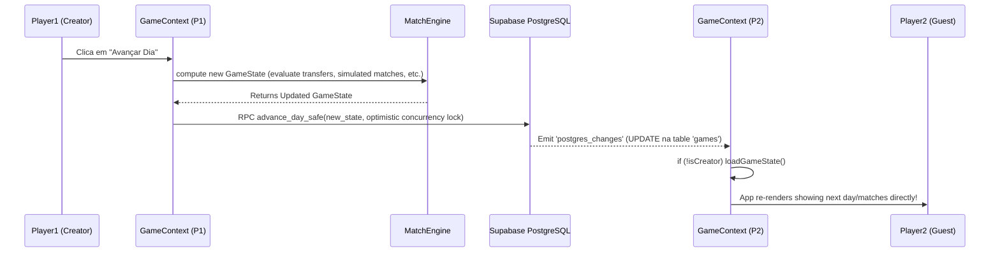
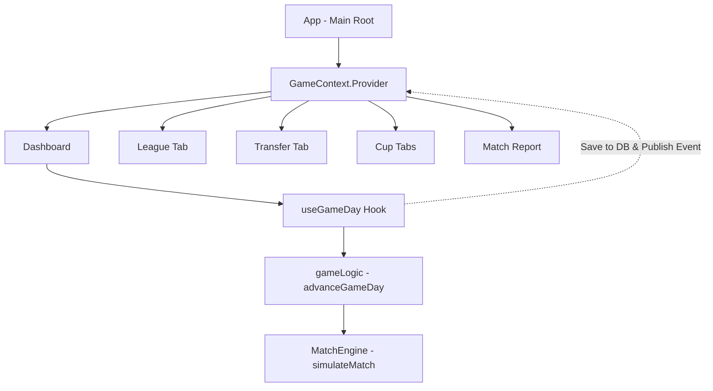

# Arquitetura Elite 2050

Este documento descreve as principais peças do jogo Elite 2050 e a estrutura definida para suportar múltiplos usuários em tempo real durante uma temporada. 

## Flowchain & Supabase Realtime

A renderização e o sincronismo baseiam-se numa subscrição direta do canal `games` no PostgreSQL via Supabase, minimizando polling e permitindo experiência fluida de Multiplayer. 

## Componentes Chave do React

## Ciclo de vida da Temporada (Estados do Mundo)

O estado global do mundo transita pelos seguintes fluxos:

- **STARTUP:** Tela de início de servidor vazio / Carregando.
- **DRAFT:** Criação de personagens e do time inicial de cada jogador.
- **LOBBY:** Modo de pré-temporada! Formação tática, observação de elencos, mercado, transferências.
- **ACTIVE:** Temporada regular acontecendo (Liga, Copas). Matches de campeonato agendados são processados pelo Creator num clique global.
- **FINISHED:** Tabela da temporada consolidada. Ao clicar para processar novo torneio, o estado reverte para LOBBY, incrementa o ano calendário, recriando novos times baseando-se no que foi deixado.

## Referência das Constantes (gameConstants.ts)

- `SEASON_DAYS`: Duração da temporada de Liga
- `MAX_TEAM_POWER_TIER_1`: 900 (Limite máximo de power cap total per squad player somado)
- `SAFETY_NET_MIN_PLAYERS`: 15 jogadores
- `MATCH_DURATION_MINUTES`: 90 (simulação de partidas por tempo)
- `SAFETY_NET_FREE_AGENT_RATING`: Avaliação base garantida para Free Agents inseridos no net

---

_Documentação gerada como parte da estabilidade Multiplayer & Testes na Temporada Multiplayer_
